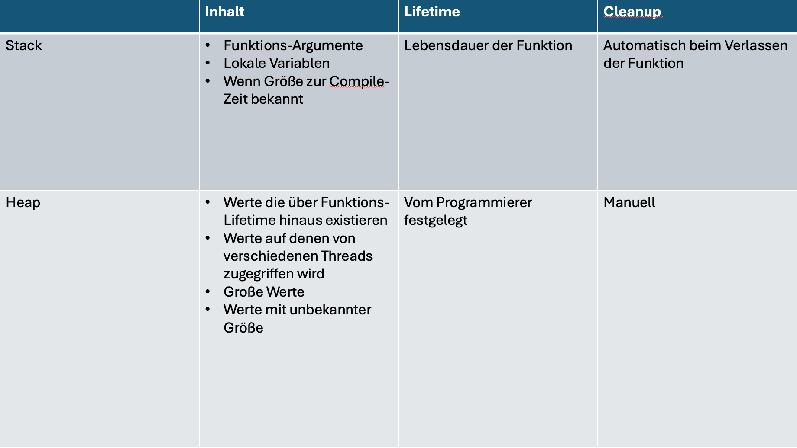

# Rust - Advanced

In diesem Kurs  werden fortgeschrittene Themen in Rust behandelt. Anhand von Beispielen, Challenges und einem Projekt werden die Themen erläutert und gefestigt.

# Traits

Ein Trait definiert die Funktionalität, die ein bestimmter Typ besitzt und mit anderen Typen teilen kann. Wir können Traits verwenden, um gemeinsames Verhalten auf abstrakte Weise zu definieren. Wir können Trait-Beschränkungen (trait bounds) verwenden, um anzugeben, dass ein generischer Typ jeder Typ sein kann, der ein bestimmtes Verhalten aufweist.

> `Traits` sind ähnlich wie Schnittstellen (interfaces) wobei es einige Unterschiede gibt.

## Verwendung von Traits

Zunächst definiert man ein Trait mit dem `trait` Schlüsselwort. Es wird gefolgt vom Namen des Trait und einem Block mit Methodensignaturen:

```rust
pub trait MeinTrait {
    fn meine_methode(&self);
}
```

Hiermit wurde eine Trait mit dem Namen `MeinTrait` und einer Methode `meine_methode` definiert.

Um die Trait zu einem Struct hinzuzufügen, verwenden wir die `impl`\-Schlüsselwort:

```rust
struct MeinTyp;

impl MeinTrait for MeinTyp {
    fn meine_methode(&self) {
        println!("Methode wurde aufgerufen");
    }
}
```

## Default Implementationen

In Rust können Traits auch Default-Implementierungen für irgendwelche Methode zur Verfügung stellen:

```rust
pub trait MeinTrait {
    fn meine_methode(&self) {
        // Default Implementierung
        println!("Methode wurde aufgerufen");
    }
}
```

Eine Struktur, die diese Trait verwendet, muss nicht `meine_methode` implementieren, es sei denn, sie muss die Standardimplementierung überschreiben.

```rust
struct MeinTyp;

impl MeinTrait for MeinTyp {} 
```

**Challenge (10 Minuten):**
Erstelle ein Trait `WhoAmI` mit einer Methode `print`, welche:

- Einen übergebenen String ausgibt, wenn der Trait implementiert wurde.
- Einen Standard-String ausgibt, wenn der Trait nicht implementiert wurde.

```rust
...
```

```rust
let m  = MeinTyp;
m.print("Hello".to_string());
```

# Generics

Generics sind ein leistungsstarkes Werkzeug, um Code in Rust zu abstrahieren. Sie ermöglichen es, Funktionen, Strukturen, Enums und Traits zu schreiben, die mit verschiedenen Typen verwendet werden können, ohne dass der Entwickler den Code für jeden Typ duplizieren muss.

## Generische Funktionen

Eine generische Funktion ist eine Funktion, die mit verschiedenen Typen verwendet werden kann. Sie werden mit einem Typparameter definiert, der in der Funktion verwendet wird, um den Typ eines Parameters oder Rückgabewerts zu spezifizieren.

**Beispiel:**

```rust
fn print_me<T: Display>(value: T) {
    println!("{}", value);
}
```

> `T` ist ein Typparameter, der in der Funktion verwendet wird, um den Typ des Parameters `value` zu spezifizieren.  
> `T` kann durch jeden Typ ersetzt werden, der die Funktion aufruft.

```rust
fn main() {
    print(1);
    print("Hello World");
}
```

Es können auch mehrere Typparameter verwendet werden:

```rust
fn print<T: Display, U: Display>(value: T, value2: U) {
    println!("{} - {}", value, value2);
}
```

```rust
fn main() {
    print(1, 2);
    print("Hello", 42);
}
```

### Rückgabewert

Ebenfalls kann ein generisches Rückgabewert angegeben werden.

```rust
fn print<T: Display>(value: T) -> T {
    println!("{}", value);
    value
}
```

```rust
fn main() {
    let result = print(1);
    println!("{}", result);
}
```

**Challenge (10 Minuten):**  
Schreibe eine generische Funktion, die zwei Werte vergleicht und den größeren Wert zurückgibt.

> **Tipp:** Der Typ muss `PartialOrd` implementieren.

```rust
...
```

```rust
fn main() {
    let result = max(1, 2);
    println!("{}", result);
}
```

## Generische Structs

Generische Structs sind Structs, die mit verschiedenen Typen verwendet werden können. Sie werden mit einem Typparameter definiert, der in der Struktur verwendet wird, um den Typ eines Feldes zu spezifizieren.

**Beispiel:**

```rust
struct Point<T> {
    x: T,
    y: T,
}
```

> `T` ist ein Typparameter, der in der Struktur verwendet wird, um den Typ der Felder `x` und `y` zu spezifizieren.

```rust
fn main() {
    let point = Point { x: 1, y: 2 };
    let float_point = Point { x: 1.0, y: 2.0 };
    println!("{} - {}", point.x, point.y);
}
```

### Mehrere Typparameter

```rust
struct Point<T, U> {
    x: T,
    y: U,
}
```

```rust
fn main() {
    let point = Point { x: 1, y: 2.0 };
    println!("{} - {}", point.x, point.y);
}
```

### Typparameter mit Default

```rust
struct Point<T, U = i32> {
    x: T,
    y: U,
}
```

```rust
fn main() {
    let point = Point { x: 1, y: 2 };
    println!("{} - {}", point.x, point.y);
}
```

### Einschränkungen

```rust
struct Point<T: alOrd, U> {
    x: T,
    y: U,
}
```

```rust
fn main() {
    let point = Point { x: 1, y: 2 };
    println!("{} - {}", point.x, point.y);
}
```

## Generische Enums

Generische Enums sind Enums, die mit verschiedenen Typen verwendet werden können. Sie werden mit einem Typparameter definiert, der in der Enum verwendet wird, um den Typ eines Feldes zu spezifizieren.

**Beispiel:**

```rust
enum Option<T> {
    Some(T),
    None,
}
```

> `T` ist ein Typparameter, der in der Enum verwendet wird, um den Typ des Feldes `Some` zu spezifizieren.

```rust
fn main() {
    let some = Option::Some(1);
    let none = Option::None;
    println!("{:?} - {:?}", some, none);
}
```

**Aufgabe:**
Schreibe eine generische Enum, die entweder einen Wert oder einen Fehler enthält.

```rust
enum Result<T, E> {
    Ok(T),
    Err(E),
}
```

```rust
fn main() {
    let ok = Result::Ok(1);
    let err = Result::Err("Error");
    println!("{:?} - {:?}", ok, err);

    match ok {
        Result::Ok(value) => println!("{}", value),
        Result::Err(value) => println!("{}", value),
    }
}
```

## Generische Traits

Generische Traits sind Traits, die mit verschiedenen Typen verwendet werden können. Sie werden mit einem Typparameter definiert, der in der Trait verwendet wird, um den Typ eines Parameters oder Rückgabewerts zu spezifizieren.

**Beispiel:**

```rust
trait Print<T> {
    fn print(&self, value: T);
}
```

> `T` ist ein Typparameter, der in der Trait verwendet wird, um den Typ des Parameters `value` zu spezifizieren.

```rust

struct Point {
    x: i32,
    y: i32,
}

impl Print<i32> for Point {
    fn print(&self, value: i32) {
        println!("{} - {} - {}", self.x, self.y, value);
    }
}

fn main() {
    let point = Point { x: 1, y: 2 };
    point.print(3);
}
```

## Komplexe Traits

Ein Trait wird als komplex angesehen, wenn es viele Methoden oder andere Traits enthält. Ein Beispiel für ein komplexes Trait könnte ein Trait "Fahrzeug" sein, das Sub-Traits wie "Fährt", "Hat Räder", "Hat Motor" usw. hat, wobei jedes dieser Traits eigene Methoden hat.

Hier ist ein einfaches Beispiel:

```rust
trait HasEngine {
    fn start_engine(&self);
}

trait HasWheels {
    fn spin_wheels(&self);
    fn steer_front_wheels(&self, degrees: i32);
}

trait Vehicle: HasWheels + HasEngine {
    fn drive(&self) {
        self.start_engine();
        self.spin_wheels();
        self.steer_front_wheels(0);
    }
}
```

# Makros

Makros sind ein leistungsstarkes Werkzeug, um die Entwicklung in Rust zu beschleunigen. Sie ermöglichen es ihnen, Code zu schreiben, der andere Code generiert. Dies hilft, Wiederholungen zu vermeiden und Code zu vereinfachen.
In diesem Abschnitt lernst du, wie du Makros in Rust verwendest und wie du deine eigenen Makros schreibst.

Wir haben sicherlich bereits Makros wie `println!` verwendet. Der Begriff Makro bezieht sich auf eine Familie von Funktionen in Rust: deklarative Makros mit `macro_rules!` und drei Arten von prozeduralen Makros:

- Eigene #[derive] Makros, die Code spezifizieren, der mit dem derive Attribut zu Strukturen und Enums hinzugefügt wird
- Attribut-ähnliche Makros, die benutzerdefinierte Attribute definieren, die auf beliebige Elemente anwendbar sind
- Funktionsähnliche Makros, die wie Funktionsaufrufe aussehen, aber auf den Token operieren, die als ihr Argument angegeben werden

## Deklarative Makros mit macro_rules!

Die am weitesten verbreitete Form von Makros in Rust ist das deklarative Makro. Diese werden manchmal auch als "macros by example", "macro_rules!" oder einfach nur "Macros" bezeichnet.  
Im Kern ermöglichen deklarative Makros das Schreiben von etwas Ähnlichem wie einem Rust `match` Ausdruck. `match` sind Kontrollstrukturen, die einen Ausdruck nehmen, den resultierenden Wert des Ausdrucks mit Mustern vergleichen und dann den Code ausführen, der mit dem passenden Muster verbunden ist.  
Makros vergleichen auch einen Wert mit Mustern, die mit bestimmtem Code verbunden sind: In dieser Situation ist der Wert der wörtliche Rust-Quellcode, der an das Makro übergeben wird; die Muster werden mit der Struktur dieses Quellcodes verglichen; und der Code, der jedem Muster zugeordnet ist, ersetzt bei Übereinstimmung den an das Makro übergebenen Code.  
**Dies alles geschieht während der Kompilierung.**

## Erstellen eine eigenen Makros

Am Beispiel eines Loggings, welches einen String und Levelparameter aufnimmt und den Eintrag in der Konsole ausgibt.

**Ein einfaches Makro:**

```rust
#[macro_export]
macro_rules! log {
    ($msg:expr) => {
        println!("{} - {}", file!(), $msg);
    };
    ($msg:expr, $level:expr) => {
        println!("{} - {} - {}", file!(), $level, $msg);
    };
}
```

**Ein komplexeres Makro:**

````rust


> `#[macro_export]` ist ein Attribut, das das Makro für die Verwendung in anderen Dateien verfügbar macht sobald das beinhaltende Crate importiert wird.
> `macro_rules!` ist ein Makro, das die Definition eines Makros erstellt.

> `$msg:expr` ist ein Muster, das auf einen beliebigen Ausdruck passt und ihn als `$msg` bindet.

Aufruf des Makros:

```rust
fn main() {
    log!("Hello World");
    log!("Hello World", "INFO");
}
````

```bash
src/main.rs - Hello World
src/main.rs - INFO - Hello World
```

**Ein komplexeres Makro:**

```rust
macro_rules! complex_macro {
    // Fällt zurück auf diesen Zweig, wenn keine anderen passen.
    ($($key:expr => $value:expr),*) => {
        {
            let mut map = std::collections::HashMap::new();
            $(
                map.insert($key, $value);
            )*
            map
        }
    };

    // Nimmt eine einzelne Zeichenkette und gibt sie aus.
    ($msg:expr) => {
        println!("Message: {}", $msg);
    };

    // Nimmt zwei Argumente: eine Bedingung und eine Nachricht.
    // Gibt die Nachricht aus, wenn die Bedingung wahr ist.
    ($cond:expr, $msg:expr) => {
        if $cond {
            println!("Condition met: {}", $msg);
        }
    };
}

fn main() {
    // Erzeugt eine HashMap aus den gegebenen Paaren.
    let map = complex_macro! {
        "key1" => 10,
        "key2" => 20
    };
    println!("{:?}", map);

    // Gibt eine einfache Nachricht aus.
    complex_macro!("This is a message");

    // Überprüft eine Bedingung und gibt eine Nachricht aus, wenn sie wahr ist.
    complex_macro!(true, "Condition is true");
}
```

### Das vec! Makro

Ein Beispiel für ein Makro, das in der Standardbibliothek von Rust enthalten ist, ist das vec! Makro. Dieses Makro nimmt eine beliebige Anzahl von Argumenten und erzeugt daraus einen Vektor.

```rust
#[macro_export]
macro_rules! vec {
    ( $( $x:expr ),* ) => {
        {
            let mut temp_vec = Vec::new();
            $(
                temp_vec.push($x);
            )*
            temp_vec
        }
    };
}
```

`( $( $x:expr ),* ) => {` ist ein Muster, das auf eine beliebige Anzahl von Ausdrücken passt und sie als `$x` bindet.

`$(` und `)*` sind sogenannte "repeaters", die den Inhalt zwischen ihnen wiederholen.  
`$x:expr` ist ein Muster, das auf einen beliebigen Ausdruck passt und ihn als `$x` bindet.

```rust
vec![1, 2, 3];
```

Erzeugt folgenden Code:

```rust
{
    let mut temp_vec = Vec::new();
    temp_vec.push(1);
    temp_vec.push(2);
    temp_vec.push(3);
    temp_vec
}
```

### Challenge:

**Challenge 1: (10 Minuten)**  
Schreibe ein Makro, welches User-Input aufnimmt und diesen getrimmt und in Kleinbuchstaben zurückgibt.

```rust
...
```

```rust
fn main() {
    let msg = user_input!();
    println!("{}", msg);
}
```

```bash
"   Hello World   "
"hello world"
```

**Challenge 2: (10 Minuten)**  
Erstelle ein Makro, anhand einer Bedingung, eines Enums entscheidet, wie der Log-Text aussehen soll.

```rust
enum LogLevel {
    INFO,
    WARN,
    ERROR,
}
/*
    Bei INFO soll der Text ohne Level ausgegeben werden.
    Bei WARN soll der Text mit dem Level WARN ausgegeben werden.
    Bei ERROR soll der Text mit dem Level ERROR ausgegeben werden.
*/

...
```

Weiteres zu Makros findest du in der [Rust Dokumentation](https://doc.rust-lang.org/book/ch19-06-macros.html) und im Abschnitt [Makros am Beispiel](https://doc.rust-lang.org/book/ch19-06-macros.html#macros-by-example) des Rust Buches.

## Prozedurale Makros mit `#[derive]`

Prozedurale Makros in Rust, die Code aus Attributen generieren, sind eine mächtige Funktion für Metaprogrammierung. Sie erlauben es, Code zur Kompilierungszeit basierend auf Attributen zu generieren oder zu modifizieren, die an Strukturen, Funktionen oder anderen Elementen angebracht sind. Diese Makros können die Struktur und das Verhalten des Codes erheblich verändern, ohne dass der Entwickler den kompletten Code manuell schreiben muss.

**Arten von prozeduralen Makros für Attribute:**  
**Attribute-like Macros**: Dies sind Makros, die wie Attribute aussehen und über Funktionen, Strukturen, Enums usw. verwendet werden können. Sie ändern oder ergänzen den Code des Elements, auf das sie angewendet werden.

**Derive Macros**: Diese ermöglichen es, die derive-Anweisung für Strukturen und Enums zu erweitern, um automatisch Implementierungen für bestimmte Traits zu generieren.

**Beispiel für ein prozedurales Makro:**  
Da die Erstellung eines prozeduralen Makros relativ komplex ist und in einer separaten Crate erfolgen muss, hier ein einfaches Beispielkonzept für ein attributähnliches Makro:

Angenommen, Sie möchten ein Makro debug_info erstellen, das für eine Struktur verwendet wird und eine Funktion implementiert, um die Strukturinformationen auszugeben:

Erstellen Sie zunächst eine neue Crate für das Makro:

```bash
cargo new debug_info --lib
cargo add proc-macro
cargo add quote
```

In der `Cargo.toml`:

```toml
[lib]
proc-macro = true
```

Das Makro:

```rust
// In der separaten Crate für das Makro:

/*
proc_macro::TokenStream: Dies ist der Typ, der für die Ein- und Ausgabe des Makros verwendet wird. Er repräsentiert einen Stream von Token, die der Rust-Compiler verarbeiten kann.
quote: Ein Hilfswerkzeug aus dem quote-Crate, das verwendet wird, um Rust-Code als Token-Stream zu generieren.
syn: Dieses Crate wird verwendet, um Rust-Code zu parsen, der als Eingabe für das Makro bereitgestellt wird.
*/
use proc_macro::TokenStream;
use quote::quote;
use syn;

/*
    #[proc_macro_attribute]: Eine Attribute-Makro-Definition. Dieses Makro wird auf Rust-Elemente (wie Strukturen) angewendet und kann deren Verhalten zur Kompilierungszeit ändern.
    debug_info: Der Name des Makros.
    _attrs: Der Teil des Makros, der die Attribute erhält, die über dem Ziel-Element angegeben wurden. In diesem Fall werden sie nicht verwendet (deshalb das führende Unterstrich _ im Namen).
    item: Der Code des Elements (z.B. einer Struktur), auf das das Makro angewendet wird.
*/
#[proc_macro_attribute]
pub fn debug_info(_attrs: TokenStream, item: TokenStream) -> TokenStream {
    /*
        Hier wird der eingehende Code (item), der die Struktur darstellt, geparst, 
        um eine syn::ItemStruct-Instanz zu erzeugen. 
        Dies ermöglicht die Bearbeitung der Strukturdefinition im Rust-Code.
     */
    let input = syn::parse_macro_input!(item as syn::ItemStruct);

    /*
        struct_name: Speichert den Namen der Struktur.
        field_names: Erzeugt eine Liste der Feldnamen der Struktur. 
        Diese Zeile verwendet Iteratoren, um über jedes Feld (repräsentiert durch f) 
        in der Struktur zu iterieren und dessen Namen zu extrahieren.
     */
    let struct_name = &input.ident;
    let field_names = input.fields.iter().map(|f| &f.ident);

    /*
        Hier beginnt die Verwendung von quote!, 
        um den generierten Code als Token-Stream zu erstellen. 
        Dieser Code wird dann in das aufrufende Rust-Programm eingefügt.
     */
    let gen = quote! {
        // Der ursprüngliche Strukturcode
        #input

        /*
            Hier wird eine Implementierung (impl) für die gegebene Struktur erzeugt, 
            die eine öffentliche Methode debug_info enthält.

            Die debug_info-Methode gibt den Namen der Struktur und die Namen aller ihrer Felder aus.
            stringify!(#struct_name): Konvertiert den Namen der Struktur in einen String zur Laufzeit.
            Das innere Makro innerhalb von quote! (gekennzeichnet durch #(...) *) 
            wird für jedes Feld der Struktur wiederholt und gibt den Namen jedes Feldes aus.
        */
        impl #struct_name {
            pub fn debug_info(&self) {
                println!("Debug-Informationen für {}", stringify!(#struct_name));
                println!("  Felder:");
                #(
                    println!("    {}", stringify!(#field_names));
                )*
            }
        }
    };
    /*
        Der generierte Token-Stream (gen) wird in den Typ TokenStream konvertiert und zurückgegeben, 
        sodass der Compiler diesen in ausführbaren Rust-Code umwandeln kann.
     */
    gen.into()
}
```

Aufruf des Makros:

```rust
use debug_info;

#[debug_info::debug_info]
struct HotStruct {
    calories: i32,
    bites: i32,
}

fn main() {
    println!("Hello, world!");
    let mut hot_struct = HotStruct {
        calories: 100,
        bites: 0,
    };
    hot_struct.debug_info();
}
```

`\#[proc_macro_attribute\]\`\` kennzeichnet eine Funktion als prozedurales Makro für Attribute.

`TokenStream` ist der Typ, der für die Ein- und Ausgabe des Makros verwendet wird.

`syn` und `quote` sind Crates, die häufig für die Parsung von Rust-Code und die Codegenerierung in prozeduralen Makros verwendet werden.

Das Beispiel erzeugt eine zusätzliche Methode debug_info für jede Struktur, auf die das Makro angewendet wird, was zur Kompilierungszeit geschieht.

## Attribute-ähnliche Makros

Attribute-ähnliche Makros sind Makros, die wie Attribute aussehen und über Funktionen, Strukturen, Enums usw. verwendet werden können. Sie ändern oder ergänzen den Code des Elements, auf das sie angewendet werden.

**Beispiel für ein Attribut-ähnliches Makro:**

````
```rust
#[route(GET, "/")]
fn index() {
    // ...
}
```
````

Das Attribut-ähnliche Makro route wird auf die Funktion index angewendet und erzeugt den Code, der die Funktion mit dem HTTP-Server verbindet.

**Erstellen eines Attribut-ähnlichen Makros:**

Das folgende Beispiel loggt mit `println!` Das Betreten und verlassen der Funktion, inkl. der übergebenen Parameter und des Funktionsnamens.

```rust
#[proc_macro_attribute]
// Definiert eine öffentliche Funktion `log` für ein prozedurales Makro.
pub fn log(attrs: TokenStream, item: TokenStream) -> TokenStream {
    // `item` repräsentiert den TokenStream des Rust-Items (z.B. eine Funktion), auf das das Makro angewendet wird.
    // Hier wird es geparst als eine Funktionsdefinition (`ItemFn`).
    let input = parse_macro_input!(item as ItemFn);

    // Parst einen Literal-String (LitStr) aus den Makro-Attributen.
    let arg = parse_macro_input!(attrs as LitStr);

    // Extrahiert den String-Wert aus dem Literal-String.
    let message = arg.value();

    // Sammelt die Eingabeparameter der Funktion.
    let inputs = &input.sig.inputs;

    // Extrahiert den Rückgabetyp der Funktion.
    let output = &input.sig.output;

    // Nimmt den Namen der Funktion.
    let function_name = &input.sig.ident;

    // Nimmt den Codeblock (Körper) der Funktion.
    let block = &input.block;

    // Sammelt die Attribute (z.B. `#[inline]`, `#[cfg(..)]`), die auf die Funktion angewendet werden.
    let attrs = &input.attrs;

    // Extrahiert die Sichtbarkeit (z.B. `pub`) der Funktion.
    let vis = &input.vis;

    // Erstellt den neuen Funktionscode. `quote!` wird verwendet, um den Rust-Code als TokenStream zu generieren.
    // Dieser neue Code fügt Log-Nachrichten vor und nach der Ausführung der ursprünglichen Funktion ein.
    let gen = quote! {
        #(#attrs)* #vis fn #function_name(#inputs) #output {
            println!("Logger says: {} before execution", #message);
            let result = (|| #block)();
            println!("Logger says: {} after execution", #message);
            result
        }
    };

    // Wandelt den generierten TokenStream in den erforderlichen Rückgabetyp um.
    gen.into()
}
```

**Challenge: (15 Minuten)**
Erstelle ein Attribut-ähnliches Makro, welches die Ausführungszeit einer Funktion misst und ausgibt.
Du kannst hierzu die `std::time::Instant` verwenden: https://doc.rust-lang.org/std/time/struct.Instant.html

```rust
...
```

```rust
#[debug_info::measure_time]
fn calc(calories_per_bite: i32, bites: i32) -> i32 {
    println!("calculating...");
    sleep(Duration::from_secs(1));
    calories_per_bite * bites
}
```

# Asynchrone Programmierung

Asynchrone Funktionen in Rust sind ein leistungsstarkes Werkzeug, um gleichzeitig mehrere Aufgaben effizient zu bewältigen, besonders bei Operationen, die auf externe Ressourcen warten müssen, wie Netzwerkanfragen oder Dateioperationen. Ich erkläre es dir Schritt für Schritt:

**Was sind asynchrone Funktionen?**

Asynchrone Funktionen ermöglichen es deinem Programm, andere Aufgaben fortzusetzen, während es auf das Abschließen einer langwierigen Operation wartet. Im Gegensatz zu synchronem Code, der blockiert und das gesamte Programm anhält, bis eine Aufgabe abgeschlossen ist, kann asynchroner Code im Hintergrund laufen, während der Hauptteil deines Programms weiterarbeitet.

**Warum Rust für asynchrone Programmierung verwenden?**

Rust bietet durch sein Memorysicherheitsmodell und seine Concurrency-Fähigkeiten eine robuste Grundlage für asynchrone Programmierung. Das bedeutet, dass man gleichzeitig hohe Leistung und Sicherheit bekommt.

## Grundkonzepte:

**Futures:** Eine Future in Rust ist eine Art Platzhalter für einen Wert, der irgendwann in der Zukunft verfügbar sein könnte. Futures sind das Rückgrat der asynchronen Programmierung in Rust.

`async` Schlüsselwort: Mit `async` kannst du eine Funktion als asynchron kennzeichnen. Eine `async` Funktion gibt automatisch eine Future zurück.
`await` Schlüsselwort: Mit `await` kannst du auf das Ergebnis einer Future warten. Es unterbricht die Ausführung der aktuellen Funktion, bis die Future bereit ist, und setzt sie dann fort.
Beispiel:

```rust
async fn tasks() {
    let ergebnis = andere_asynchrone_funktion().await;
    // Verarbeite das Ergebnis
}
```

In diesem Beispiel ruft `tasks` eine andere asynchrone Funktion auf und wartet mit `await` auf das Ergebnis.

**Ausführen asynchroner Funktionen:**  
Um asynchrone Funktionen auszuführen, benötigst du einen sogenannten Executor, der die Futures verwaltet und ausführt. Rusts Standardbibliothek bietet keinen Executor, aber es gibt externe Bibliotheken wie `tokio` oder async-std, die dies ermöglichen.

## Auswahl verschiedener Bibliotheken für asynchrone Programmierung

In Rust ist die asynchrone Programmierung eine lebendige Landschaft mit mehreren Bibliotheken, die unterschiedliche Ansätze und Funktionen bieten. Drei der prominentesten Bibliotheken in diesem Bereich sind Tokio, async-std und Mio.

1. **Tokio**  
   Populär und weit verbreitet: Tokio ist eines der bekanntesten und am häufigsten genutzten asynchronen Runtime-Systeme in der Rust-Community. Es hat eine große Nutzerbasis und wird in vielen Projekten eingesetzt. Feature-Reich: Tokio bietet eine umfangreiche Sammlung von Funktionen, einschließlich TCP/UDP-Netzwerken, Dateisystemoperationen, Zeitmessung und mehr. Es ist besonders stark in Netzwerk- und I/O-bezogenen Aufgaben. Leistungsfähig: Tokio ist für seine Leistung bekannt und eignet sich gut für hochlastige, skalierbare Anwendungen. Makro-Unterstützung: Tokio verwendet Makros wie #[tokio::main] und #[tokio::test], die die Verwendung in vielen Fällen vereinfachen. Lernkurve: Aufgrund seiner umfangreichen Funktionalität und Eigenheiten kann Tokio eine steilere Lernkurve für Einsteiger haben.
2. **async-std**  
   Einfache Anwendung: async-std zielt darauf ab, ein einfaches und intuitives API zu bieten, das stark an die Standardbibliothek von Rust angelehnt ist. Dies macht den Einstieg für Anfänger oft einfacher. Leistung: Obwohl async-std für gute Leistung bekannt ist, wird es oft als etwas weniger leistungsfähig im Vergleich zu Tokio betrachtet, insbesondere in Bezug auf bestimmte Netzwerk- oder I/O-intensive Aufgaben. Kompatibilität: async-std ist oft kompatibel mit vielen Futures und asynchronen Ecosystems, die für Tokio entwickelt wurden, was die Integration erleichtert. Entwicklererfahrung: Der Fokus liegt auf einer sauberen und wartbaren Codebasis und einer guten Entwicklererfahrung.
3. **Mio**  
   Low-Level: Mio ist eine Low-Level Event-Loop-Bibliothek, die als Basis für andere Hoch-Level-Bibliotheken wie Tokio dient. Sie ist darauf ausgerichtet, den Kern einer Event-Loop mit Non-Blocking I/O direkt zu verwalten. Performance: Mio ist für seine hohe Leistung bekannt, da sie direkt auf OS-Level APIs wie epoll, kqueue, und IOCP zugreift. Weniger Abstraktionen: Im Gegensatz zu Tokio oder async-std bietet Mio weniger Abstraktionen, was mehr Kontrolle, aber auch mehr Komplexität für den Entwickler bedeutet. Verwendung: Mio wird oft als Grundlage für andere Frameworks oder für sehr spezifische Use-Cases verwendet, wo eine direkte Kontrolle über die Event-Loop benötigt wird.

# Tokio

Tokio ist eine asynchrone Laufzeitumgebung für die Ausführung von asynchronem Code mit Rust. Tokio bietet eine API zum Schreiben von asynchronem Code, eine Laufzeitumgebung, die diesen Code ausführt, und Tools zum Debuggen von asynchronem Code.

**Installation:**

```toml
[dependencies]
tokio = { version = "1.35.1", features = ["full"] }
futures = "0.3.30"
```

**Installation mit Cargo**

```bash
cargo add tokio --features full
cargo add futures
```

## Asynchrone Funktion mit Tokio

```rust
use tokio::time::{sleep, Duration};


async fn tasks() {
    println!("Starte Aufgabe 1");
    sleep(Duration::from_secs(2)).await;
    println!("Aufgabe 1 beendet");
}

#[tokio::main]
async fn main() {
    tasks().await;
}
```

> `await` ist ein Schlüsselwort, das die Ausführung der aktuellen Funktion unterbricht, bis die Future bereit ist, und sie dann fortsetzt.

#### tokio::main-Makro

`#[tokio::main]` ist ein Makro, das die `main` Funktion in eine asynchrone Funktion umwandelt und eine Tokio-Laufzeitumgebung erstellt.

Durch das Makro wird aus einer einfachen Funktion wie:

```rust
#[tokio::main]
fn main() {
    println!("Hello, world!");
}
```

folgender Code:

```rust
fn main() {
    let mut rt = tokio::runtime::Runtime::new().unwrap();
    rt.block_on(async {
        println!("Hello World");
    })
}
```

> `block_on` ist eine Funktion, die eine Future ausführt und auf das Ergebnis wartet.

**Asynchrone Funktionen mit Rückgabewert**

```rust
use tokio::time::{sleep, Duration};


async fn tasks() -> String {
    println!("Starte Aufgabe 1");
    sleep(Duration::from_secs(2)).await;
    println!("Aufgabe 1 beendet");
    "Ergebnis".to_string()
}

#[tokio::main]
async fn main() {
    let ergebnis = tasks().await;
    println!("{}", ergebnis);
}
```

**Asynchrone Funktionen mit Rückgabewert und Parameter**

```rust
use tokio::time::{sleep, Duration};


async fn tasks(a: i32, b: i32) -> i32 {
    println!("Starte Aufgabe 1");
    sleep(Duration::from_secs(2)).await;
    println!("Aufgabe 1 beendet");
    a + b
}

#[tokio::main]
async fn main() {
    let ergebnis = tasks(1, 2).await;
    println!("{}", ergebnis);
}
```

**Asynchrone Funktionen mit Rückgabewert und Parameter und Result**

```rust
use tokio::time::{sleep, Duration};


async fn tasks(a: i32, b: i32) -> Result<i32, String> {
    println!("Starte Aufgabe 1");
    sleep(Duration::from_secs(2)).await;
    println!("Aufgabe 1 beendet");
    Ok(a + b)
}

#[tokio::main]
async fn main() {
    let ergebnis = tasks(1, 2).await;
    println!("{}", ergebnis.unwrap());
}
```

**Parallelität mit Tokio**

```rust
use tokio::time::{sleep, Duration};


async fn tasks(a: i32, b: i32) -> Result<i32, String> {
    println!("Starte Aufgabe 1");
    sleep(Duration::from_secs(2)).await;
    println!("Aufgabe 1 beendet");
    Ok(a + b)
}

#[tokio::main]
async fn main() {
    let ergebnis = tokio::join!(tasks(1, 2), tasks(3, 4));
    for e in ergebnis {
        println!("{}", e.unwrap());
    }
}
```

> `join` ist ein Makro, das die Ausführung mehrerer Futures parallelisiert und auf das Ergebnis wartet.

**Der erst Beste:**  
Sollte es einmal reichen, nur auf die erste Task zu warten, kann mit `select`gearbeitet werden.

```rust
use tokio::time::{sleep, Duration};


async fn tasks(a: i32, b: i32) -> Result<i32, String> {
    println!("Starte Aufgabe 1");
    sleep(Duration::from_secs(2)).await;
    println!("Aufgabe 1 beendet");
    Ok(a + b)
}   

#[tokio::main]
async fn main() {
    let ergebnis = tokio::select!(r1 = tasks(1, 2), r2 = tasks(3, 4));
    println!("{}", ergebnis);
}
```

> `select` ist ein Makro, das die Ausführung mehrerer Futures parallelisiert und auf das Ergebnis wartet.

**Timeouts:**  
Da `select` nur auf die erste Task wartet, kann mit `tokio::time::sleep` ein Timeout gesetzt werden:

```rust
use tokio::time::{sleep, Duration};


async fn tasks(a: i32, b: i32) -> Result<i32, String> {
    println!("Starte Aufgabe 1");
    sleep(Duration::from_secs(2)).await;
    println!("Aufgabe 1 beendet");
    Ok(a + b)
}

#[tokio::main]
async fn main() {
    let ergebnis = tokio::select! {
        r1 = tasks(1, 2) => r1,
        _ = tokio::time::sleep(Duration::from_secs(1)) => Err("Timeout".to_string()),
    };
    println!("{}", ergebnis.unwrap());
}
```

**Challenge 1: (25 Minuten)**  
Erstelle ein Rust-Programm, das die Tokio-Bibliothek verwendet, um asynchron fünf verschiedene Zahlen auf Primzahleigenschaften zu prüfen.
Prüfen Sie alle fünf Zahlen unabhängig voneinander auf ihre Primzahleigenschaft und geben Sie die Ergebnisse aus, sobald sie berechnet sind.

**Challenge 2: (25 Minuten)** .
Erstelle ein ein macro_rules! Makro, welches:

- eine beliebige Anzahl von Zahlen aufnimmt
- `is_prime` auf die Zahlen anwendet
- das erste Ergebnis ausgibt
- Der Aufruf des Makros soll wie folgt aussehen:

```rust
...
```

```rust
async fn main() {
    select_primes!(1999999927, 2000000872, 2000000087, 2000000084);
}
```

Infos zur macro Syntax: https://doc.rust-lang.org/reference/macros-by-example.html

## Futures

Eine Future in Rust ist eine Art Platzhalter für einen Wert, der irgendwann in der Zukunft verfügbar sein könnte. Futures sind das Rückgrat der asynchronen Programmierung in Rust.

**Erstellen einer Future**

```rust
use futures::future::Future;
use futures::future::ready;

fn main() {
    let future = ready(42);
}
```

## TCP-Listener

Tokio bietet eine API zum Erstellen von TCP-Listenern, die eingehende Verbindungen akzeptieren und Streams von Datenpaketen zurückgeben. Dies ist ein Beispiel für einen TCP-Listener, der auf Port 8080 lauscht und die eingehenden Verbindungen akzeptiert:

```rust
use tokio::net::TcpListener;

#[tokio::main]
async fn main() {
    let listener = TcpListener::bind("127.0.0.1:8080").await.unwrap();
    loop {
        let (socket, _) = listener.accept().await.unwrap();
        tokio::spawn(async move {
            process(socket).await;
        });
    }
}

async fn process(socket: TcpStream) {
    // Verarbeite die Verbindung
}
```

> `tokio::spawn`  
> ist eine Funktion, die eine asynchrone Funktion in einem neuen Task ausführt.

> `TcpListener::bind`  
> ist eine Funktion, die einen TCP-Listener erstellt, der auf einem bestimmten Port lauscht.

> `move`  
> ist ein Schlüsselwort, das die Besitzverhältnisse von Variablen in eine asynchrone Funktion überträgt.


```dart
use tokio::fs::File;
use tokio::io::{AsyncReadExt, AsyncWriteExt};
use tokio::net::{TcpListener, TcpStream};

// #[tokio::main] ist ein Macro, welches die main-Funktion in einen Tokio-Task umwandelt.
#[tokio::main]
async fn main() -> Result<(), Box<dyn std::error::Error>> {
    // Hier wird der TCP-Listener erstellt und auf Port 8080 gebunden.
    let listener = match TcpListener::bind("127.0.0.1:8080").await {
        Ok(listener) => {
            println!("TCP-Listener erfolgreich erstellt.");
            listener
        }
        Err(e) => {
            println!("Fehler beim Erstellen des TCP-Listeners: {}", e);
            // into() konvertiert den Fehler in ein Box<dyn std::error::Error>
            // Box<dyn std::error::Error> ist ein Trait-Objekt, welches alle Typen akzeptiert, die das std::error::Error Trait implementieren.
            // dyn bedeutet dynamic, also dynamisch. Das bedeutet, dass der Typ zur Laufzeit bestimmt wird.
            // Trait-Objekte können nur über Referenzen verwendet werden, da sie sonst ihre Größe nicht kennen würden.
            return Err(e.into());
        }
    };

    // Hier wird der TCP-Listener auf eingehende Verbindungen gehorcht.
    loop {
        // _ ist ein Platzhalter für Variablen, die nicht verwendet werden.
        let (socket, _address) = match listener.accept().await {
            // Wenn eine Verbindung akzeptiert wurde, wird ein neuer Socket und die Adresse des Clients zurückgegeben.
            Ok((socket, address)) => {
                println!("Neue Verbindung von: {}", address);
                (socket, address)
            }
            // Wenn ein Fehler auftritt, wird dieser ausgegeben und die Schleife fortgesetzt.
            Err(e) => {
                println!("Fehler beim Akzeptieren der Verbindung: {}", e);
                continue;
            }
        };

        tokio::spawn(async move {
            if let Err(e) = handle_client(socket).await {
                println!("Fehler bei der Bearbeitung des Clients: {}", e);
            }
        });
    }
}

async fn handle_client(mut socket: TcpStream) -> Result<(), std::io::Error> {
    let mut name_buffer: [u8; 256] = [0; 256];
    let mut alt_buffer = [0u8; 1024];
    // Erstelle einen Puffer mit einer Größe von 1024 Bytes
    // [0; 1024] ist ein Array mit 1024 Elementen, die alle den Wert 0 haben.
    let mut buffer: [u8; 1024] = [0; 1024];

    // Lies Dateinamen vom Client
    let name_bytes_read = match socket.read(&mut name_buffer).await {
        Ok(bytes_read) => {
            println!("{} Bytes vom Client empfangen.", bytes_read);
            bytes_read
        }
        Err(e) => {
            println!("Fehler beim Lesen vom Client: {}", e);
            return Err(e);
        }
    };
    let mut file = match File::create(format!(
        "files/{}",
        String::from_utf8_lossy(&name_buffer[..name_bytes_read]).trim()
    )).await{
        Ok(file) => {
            println!("Datei erfolgreich erstellt.");
            file
        }
        Err(e) => {
            println!("Fehler beim Erstellen der Datei: {}", e);
            return Err(e);
        }
    };

    // Lies Daten vom Client
    let bytes_read = match socket.read(&mut buffer).await {
        Ok(bytes_read) => {
            println!("{} Bytes vom Client empfangen.", bytes_read);
            bytes_read
        }
        Err(e) => {
            println!("Fehler beim Lesen vom Client: {}", e);
            return Err(e);
        }
    };

    // Konvertiere die empfangenen Daten in einen String und gebe diesen aus.
    // [..bytes_read] ist ein Slice, der nur die empfangenen Bytes enthält.
    let answer_bytes = format!(
        "{} Bytes vom Client empfangen.: {}",
        bytes_read,
        String::from_utf8_lossy(&buffer[..bytes_read])
    );
    print!("Antwort an Client: ");
    println!("{}", answer_bytes);

    // Nur zum Zwecke dieses Beispiels, schreibe die empfangenen Daten zurück zum Client
    if bytes_read > 0 {
        match socket.write_all(answer_bytes.as_bytes()).await {
            Ok(_) => println!("Antwort an Client gesendet."),
            Err(e) => {
                println!("Fehler beim Senden der Antwort an den Client: {}", e);
                return Err(e);
            }
        };
        file.write_all(&buffer[..bytes_read]).await?;
    }

    Ok(())
}

```


**Challenge:**
Erstelle einen TCP-Server mit folgenden Eigenschaften:
- Einrichten eines asynchronen TCP-Servers, der Verbindungen akzeptiert und Daten empfängt.
- Primzahlenberechnung: Implementierung einer asynchronen Funktion zur Berechnung von Primzahlen.
- Der TCP Server nimmt einen Wert vom Client auf und interpretiert diesen als u64
- Jede Zahl 2..n wird überprüft, ob diese eine Primzahl ist.
- Ist die geprüfte Zahl eine Primzahl, so wird diese zurück an den Client geschrieben.

Verbindungsaufbau: `nc 127.0.0.1 8080`
Dann Obergrenze übermitteln: `2800014`


# Actix Web
https://actix.rs/docs/getting-started

https://serde.rs/derive.html
https://docs.rs/serde_json/latest/serde_json/


Actix Web ist ein leistungsstarkes, pragmatisches und extrem schnelles Web-Framework für Rust. Es ist bekannt für seine Geschwindigkeit und seine Fähigkeit, eine hohe Anzahl von Anfragen pro Sekunde zu bewältigen. Actix Web wird oft für die Entwicklung von hochperformanten Web-Anwendungen und APIs verwendet. Hier sind einige Schlüsselaspekte von Actix Web:

**Leistungsstärke und Geschwindigkeit** 
Actix Web basiert auf dem Actix-Aktor-Framework, das eine hohe Konkurrenzfähigkeit und Effizienz bietet.
Es ist eines der schnellsten Web-Frameworks in Rust und wird oft in Benchmarks hervorgehoben.

**Typsicherheit** 
Als Rust-Framework profitiert Actix Web von der strengen Typsicherheit und Kompilierzeitprüfungen von Rust, was zu sichererem und robusterem Code führt.

**Einfach zu bedienen**  
Actix Web bietet eine einfache und intuitive API, die das Erstellen von Webservern und -anwendungen erleichtert.
Es unterstützt verschiedene Middleware, Router und Request-Handler, die die Entwicklung vereinfachen.

**Flexibilität**  
Das Framework ist flexibel und erweiterbar. Es lässt sich gut mit anderen Rust-Bibliotheken und -Tools kombinieren.
Es unterstützt WebSockets, Server-Sent Events, und andere moderne Web-Technologien.

## Installation

Für die aktuelle Major Version von Actix (4) empfiehlt sich rust auf den neusten Stand zu bringen, da es sonst zu Problemen mit Abhängigkeiten kommen kann.

```bash
rustup update
cargo new actix_web_app
cd actix_web_app
```

_Cargo.toml_:

```toml
...
[dependencies]
actix-web = "4"
```

```rust
// Importieren notwendiger Module und Typen aus der actix_web-Bibliothek.
use actix_web::{get, post, web, App, HttpResponse, HttpServer, Responder};

// Definiert eine asynchrone Handler-Funktion `hello` für GET-Anfragen an die Wurzelroute ("/").
#[get("/")]
async fn hello() -> impl Responder {
    // Sendet eine HTTP-Antwort mit dem Statuscode 200 (OK) und dem Textkörper "Hello world!".
    HttpResponse::Ok().body("Hello world!")
}

// Definiert eine asynchrone Handler-Funktion `echo` für POST-Anfragen an die Route "/echo".
#[post("/echo")]
async fn echo(req_body: String) -> impl Responder {
    // Sendet eine HTTP-Antwort mit dem Statuscode 200 (OK) und gibt den Anfrage-Textkörper zurück.
    HttpResponse::Ok().body(req_body)
}

// Definiert eine weitere asynchrone Handler-Funktion `manual_hello`.
async fn manual_hello() -> impl Responder {
    // Sendet eine HTTP-Antwort mit dem Statuscode 200 (OK) und dem Textkörper "Hey there!".
    HttpResponse::Ok().body("Hey there!")
}

// Markiert die Hauptfunktion als asynchronen Einstiegspunkt für Actix Web.
#[actix_web::main]
async fn main() -> std::io::Result<()> {
    // Erstellt und startet einen neuen HTTP-Server.
    HttpServer::new(|| {
        // Erstellt eine neue Actix-App.
        App::new()
            // Fügt den `hello`-Handler als Service für GET-Anfragen hinzu.
            .service(hello)
            // Fügt den `echo`-Handler als Service für POST-Anfragen hinzu.
            .service(echo)
            // Definiert eine Route "/hey" und setzt `manual_hello` als Handler für GET-Anfragen.
            .route("/hey", web::get().to(manual_hello))
    })
    // Bindet den Server an die Adresse "127.0.0.1" auf Port 8080.
    .bind(("127.0.0.1", 8080))?
    // Startet den Server und wartet auf eingehende Verbindungen.
    .run()
    // Wartet auf das Ende des Servers.
    .await
}
```

## Threadübergreifende Variable

Actix Web bietet eine Möglichkeit, threadübergreifende Variablen zu definieren, die in allen Anfragen verfügbar sind. Dies ist nützlich, um Daten zu speichern, die in allen Anfragen verwendet werden sollen, z.B. eine Datenbankverbindung.

Hierzu benötigen wir etwas tieferes wissen über Mutex und Atomic References:

`Mutex` steht für "mutual exclusion" und ist ein Mechanismus zur Gewährleistung des gegenseitigen Ausschlusses. Er wird verwendet, um sicherzustellen, dass nur ein Thread gleichzeitig auf die darin enthaltenen Daten zugreifen kann.
Mutex::new(Items { ... }) erstellt einen neuen Mutex, der die Items-Struktur einschließt. Dadurch wird sichergestellt, dass der Zugriff auf Items thread-sicher ist, d.h., kein gleichzeitiger schreibender Zugriff von mehreren Threads erfolgt, was zu Datenrennen und Inkonsistenzen führen könnte.


`Arc::new(...):`  
`Arc` steht für "Atomic Reference Counting". Es ist ein Typ, der es ermöglicht, einen Wert sicher zwischen mehreren Threads zu teilen, indem für jeden Klon des Arc ein interner Zähler erhöht wird. Wenn alle Klone des Arc außer Betrieb genommen werden, wird der darin enthaltene Wert freigegeben.

`let shared_items = Arc::new(Mutex::new(Items { ... }));`

`web::Data` ist ein Actix Web-Typ, der verwendet wird, um threadübergreifende Variablen zu definieren. Es wird verwendet, um den Zugriff auf die in ihm enthaltenen Daten zu verwalten. Es ist ein generischer Typ, der den Typ der in ihm enthaltenen Daten als Parameter erwartet. 

`let shared_items = web::Data::new(Arc::new(Mutex::new(create_inventory())));`

**Verwenden von threadübergreifenden Variablen**

```rust
let shared_items = web::Data::new(Arc::new(Mutex::new(create_inventory())));

HttpServer::new(move || {
        App::new()
            .app_data(web::Data::new(shared_items.clone()))
            ...
```

**Challenge**  
Erstelle eine Web-Api, welche folgende Eigenschaften hat:
- Erstelle ein Inventar-Struct mit den Feldern: id, name (Anzahl)
- /api/get/$id -> Gibt einen Eintrag mit der ID $id zurück
- /api/get_all -> Gibt alle Einträge zurück
- /api/add -> Fügt einen Eintrag hinzu
- /api/delete/$id -> Löscht einen Eintrag mit der ID $id

# Webrequests
https://docs.rs/reqwest/0.11.4/reqwest/

https://rust-lang-nursery.github.io/rust-cookbook/web/clients/requests.html

https://dev.to/pintuch/rust-reqwest-examples-10ff

**Challenge:**  
Nutze reqwest und serde um drei verschiedene Haustiere im Store anzulegen.  
Lese anschließend mit der erzeugten ID die Haustiere wieder aus.   

https://petstore3.swagger.io/


# SQL Datenbanken
https://rust-lang-nursery.github.io/rust-cookbook/database/sqlite.html

**Challenge:**  
Wir, das Tierheim Flauschfell, gehen eine Kooperagtion mit dem Swagger-Petshop ein.
In unserer Datenbank befinden sich zur Zeit drei Tiere:  
**Alex**, Kategorie: Hund, Tags: ("klein"), ("zutraulich")  
**Sydney**, Kategorie: Katze, Tags: ("mopsig"), ("zutraulich"), ("Hinterhältig")  
**Stewie**, Kategorie: Meerschwein, Tags: ("ruhig"), ("kinderscheu")  

Implementiere folgene Funktionen:  
`add_pet(...)`: wenn ein neues Haustier im Tierheim abgegeben wird, so wird dieses in der Datenbank, sowie im Petstore angelegt.  
`remove_pet(...)`: entfernt das Haustier aus der Datenbank, nicht jedoch vom Petstore.  
`show_all_pets(...)`: gibt alle Haustiere aus der Datenbank aus.  
`show_pets_with_tag`: gibt alle Haustiere aus, die einen angegebenen Tag haben.  
  
# GUI
https://slint.dev/releases/1.3.2/docs/tutorial/rust/introduction

**Challenge:**
Erstelle eine GUI, welche die Haustiere aus der Datenbank anzeigt und es ermöglicht neue Haustiere hinzuzufügen.


# Heap / Stack


## Copy / Clone

**Copy**  
Typischerweise implementieren kleine, einfache Typen wie Ganzzahlen (i32, u64), Booleans (bool), und Gleitkommazahlen (f32, f64) das Copy Trait.  
Diese Typen sind in der Regel auf der Stack-Allokation beschränkt und relativ billig zu kopieren.  

Kein expliziter Aufruf nötig: Du rufst niemals explizit eine Copy-Funktion auf; das Kopieren geschieht automatisch.  

_Eigenschaften:_  
Ein Typ kann Copy implementieren, wenn alle seine Teile ebenfalls Copy implementieren.  


**Clone Trait**
Manuelle Duplizierung: Das Clone Trait ermöglicht es einem Typ, eine Methode .clone() zu definieren, die explizit aufgerufen werden muss, um eine Kopie des Wertes zu erstellen.

**Komplexere Typen:** Clone ist für komplexere Typen gedacht, insbesondere für solche, die teilweise oder ganz auf dem Heap gespeichert sind, wie Strings (String) und Vektoren (Vec<T>).  
Die Duplizierung kann teurer sein, da sie möglicherweise eine Allokation auf dem Heap und das Kopieren von Daten erfordert.  

Expliziter Aufruf: Um ein Objekt zu klonen, das Clone implementiert, rufst du die .clone() Methode explizit auf.  

**Eigenschaften:**

Im Gegensatz zu Copy kann Clone für nahezu jeden Typ implementiert werden, einschließlich solcher, die Ressourcen verwalten.

```rust
#[derive(Debug, Clone, Copy)] // Wir leiten Clone und Copy ab
struct Point {
    x: i32,
    y: i32,
}

fn main() {
    let point1 = Point { x: 5, y: 10 };
    let point2 = point1; // point1 wird hier kopiert, nicht verschoben

    // Beide Punkte können unabhängig voneinander verwendet werden,
    // da point1 kopiert wurde, als point2 erstellt wurde
    println!("point1: {:?}", point1);
    println!("point2: {:?}", point2);
}
```


# Lifetimes

<details>
  <summary>Code Beispiele</summary>
    
  ```rust  
fn main() {
    main_8();
}

// DANGELING REFERENCE

fn main_dangeling() {
    let r: &i32;
    {
        let x = 5;
        r = &x; // borrowed value does not live long enough
    }
    // r ist eine referenz auf x, aber x ist nicht mehr gültig
    // Rust bemerkt dies zur Compilezeit und verhindert den Zugriff auf r
    println!("r: {}", r);
}

fn main_dangeling_2() {
    let x: i32 = 5;

    let r: &i32 = &x;

    println!("r: {}", r);
}

// Generic Lifetime Annotation (kurz: Lifetimes)

// longest nimmt zwei Referenzen auf Strings und
// gibt eine Referenz auf den längeren String zurück
//
// Wie kann der Borrow Checker sicherstellen, dass die
// Rückgabe-Referenz gültig und nicht dangeling ist?
// Was ist die Lebenszeit der Rückgabe-Referenz?
fn longest(x: &str, y: &str) -> &str {
    /*
    missing lifetime specifier
    this function's return type contains a borrowed
    value, but the signature does not say whether
    it is borrowed from `x` or `y`
     */
    if x.len() > y.len() {
        x // x kann eine andere Lifetime haben
    } else {
        y // als y
    }
    // X und Y könnten von vielen verschiedenen Aufrufen und Scopes kommen,
    // Der Borrow Checker kann also nicht wissen wie lange x und y leben
}

fn main_2() {
    let string1 = String::from("abcd");
    let string2 = String::from("xyz");

    let result = longest(string1.as_str(), string2.as_str());
    println!("The longest string is {}", result);
}

// Generic Liftime Annotations beschreiben die Beziehung
// zwischen den Lebenszeiten von mehreren Referenzen
// Die Lebenszeiten der Referenzen werden also nicht verändert
// sondern nur beschrieben.

// Wie bei allen Generics, werden auch Lifetime Generics
// mit Spitzenklammern, nach dem Funktionsnamen, angegeben.
// Sie beginnen immer mit einem Apostroph (').
// Konventions ist es mit klein geschriebenen Buchstaben,
// angefangen bei a zu beginnen.
// x und y können nun beide diese Lifetime haben, ebenso wie
// die Rückgabe-Referenz.

// Syntax-Beispiele:
// &i32        // eine Referenz
// &'a i32     // eine Referenz mit Lifetime 'a
// &'a mut i32 // eine mutable Referenz mit Lifetime 'a
fn longest_2<'a>(x: &'a str, y: &'a str) -> &'a str {
    // Die Lifetime wurde nicht verändert.
    // Wir haben jedoch beschrieben, dass die Lifetime
    // zwischen x, y und der Rückgabe-Referenz in Relation stehen.

    // Die Rückgabe-Referenz hat nun die kleinste der beiden Lifetimes
    if x.len() > y.len() {
        x
    } else {
        y
    }
}

fn main_3() {
    let string1 = String::from("abcd");
    let string2 = String::from("xyz");

    let result = longest_2(string1.as_str(), string2.as_str());
    // Da wir dem Borrow Checker nun mitgeteilt haben, dass
    // die Rückgabe-Referenz die kleinste der beiden Lifetimes hat,
    // kann er nun sicherstellen, dass die Rückgabe-Referenz gültig ist,
    // indem er die Lebenszeit von string1 und string2 überprüft.
    println!("The longest string is {}", result);
}

fn main_4() {
    let string1 = String::from("abcd");

    {
        let string2 = String::from("xyz");
        let result = longest_2(string1.as_str(), string2.as_str());
        println!("The longest string is {}", result);
    }
}

fn main_5() {
    let string1 = String::from("abcd");
    let result: &str;
    {
        let string2 = String::from("xyz");
        result = longest_2(string1.as_str(), string2.as_str());
        /*
        `string2` does not live long enough
        borrowed value does not live long enough
         */
    }
    // Challenge:
    // Löse das Problem, das der geliehene Wert nicht lange genug lebt.
    println!("The longest string is {}", result);
}


fn longest_3<'a>(x: &str, y: &str) -> &'a str {
    let result = String::from("it's a me!");
    /*
    cannot return value referencing local variable `result`
    returns a value referencing data owned by the current function
    */

    // result ist eine lokale Variable, die nicht mehr gültig ist,
    // sobald die Funktion verlassen wird.
    result.as_str()
}

fn longest_4(x: &str, y: &str) -> String {
    let result = String::from("it's a me!");

    // Da longest_4 Ownership von result hat,
    // kann dieser Wert zurückgegeben werden.
    // Dazu wird die Ownership von result an die aufrufende Funktion
    // übergeben.
    result
}

fn main_6(){
    let string1 = String::from("abcd");
    let string2 = String::from("xyz");
    let result = longest_3(string1.as_str(), string2.as_str());
    println!("The longest string is {}", result);
}


// Lifetime Annotations in Structs

// Wenn wir in structs Referenzen verwenden, müssen wir
// auch hier die Lifetimes angeben.

// Unser struc Book kann also nicht länger als 
// die Lifetime der Referenz opening leben.
struct Book<'a> {
    opening: &'a str,
}
// missing lifetime specifier
// expected named lifetime parameter

fn main_7() {
    let book_opening = String::from("It began with the forging of the Great Rings. Three were given to the Elves, immortal, wisest and fairest of all beings.");
    let first_sentence = book_opening.split('.').next().expect("Could not find a '.'");

    let lotr: Book = Book {
        opening: first_sentence,
    };

    println!("The opening of the book is: {}", lotr.opening);

}

fn first_word<'a>(s: &'a str) -> &'a str {
    let bytes = s.as_bytes();
    for (i, &item) in bytes.iter().enumerate(){
        if item == b' ' {
            return &s[..i];
        }
    }
    &s[..]
}
// In dieser Funktion haben wir keine Lifetime Annotationen angegeben.
// Dennoch funktioniert die Funktion, da der Compliler die Lifetime
// da er die drei Lifetime Elision Rules prüft.

// Lifetimes von Parameter-Referenzen nennen wir Input Lifetimes.
// Lifetimes von Rückgabe-Referenzen nennen wir Output Lifetimes.

// Lifetime Elision Rules:
// 1. Jeder Parameter, der eine Referenz ist, bekommt eine eigene Lifetime.
// 2. Wenn es nur einen Input Lifetime gibt, wird dieser Lifetime
//    für alle Output Lifetimes verwendet.
// 3. Wenn es mehrere Input Lifetimes gibt, jedoch eine davon &self oder &mut self ist,
//    wird die Lifetime von self für alle Output Lifetimes verwendet.
 fn no_ticks_first_word(s: &str) -> &str {
     let bytes = s.as_bytes();
     for (i, &item) in bytes.iter().enumerate(){
         if item == b' ' {
             return &s[..i];
         }
     }
     &s[..]
 }


// Da Lifetime Annotations Generics sind,
// müssen wir bei einer Implementierung,
// <'a> hintert impl und nach dem Structnamen angeben.
impl <'a> Book<'a> {
    /*
    implicit elided lifetime not allowed here
    expected lifetime parameter
     */
//                 'a     'b                    - Regel 1: Jeder Parameter bekommt eine eigene Lifetime
//                |      |                 'a   - Regel 3: Da self eine Lifetime hat, wird diese für alle Output Lifetimes verwendet.
    fn get_opening(&self, intro: &str) -> &str {
        println!("{}", intro);                     
        self.opening
    }
}


// STATIC


// Static Lifetime heißt, dass die Referenz für die gesamte Laufzeit des Programms gültig ist.
// Alle String Literale haben die Lifetime 'static.
fn main_8() {
    let refr: &str;
    // let refr2: &i32;
    // let refr3: &i32;
    {
        let x = 7;
        let y: &'static i32 = &17;
        let s: &'static str = "I am a static string with a static lifetime";
        let st: String = "I am also String with a static lifetime".to_string();
        refr = s;
        // refr2 = &x;
        // refr3 = y;

        /*
        `x` does not live long enough
            borrowed value does not live long enough
         */
    }
    println!("{}", refr);
    // println!("{}", refr2);
    // println!("{}", refr3);
}

  ```
  
</details>

<details>
  <summary>Challenge</summary>
    
```rust
struct Book {
    title: &str,
    cover_text: String,
}

trait Cover {
    fn get_title(&self) -> &str;
    fn get_cover_text(&self) -> &str;
}

impl Cover for Book {
    fn get_title(&self) -> &str {
        self.title
    }

    fn get_cover_text(&self) -> &str {
        &self.cover_text
    }
}

struct Inventory {
    books: Vec<&Book>,
}

impl Inventory {
    fn add_book(&mut self, book: &Book) {
        self.books.push(book);
    }

    fn show_titles(&self) {
        for book in &self.books {
            println!("Title: {}", book.get_title());
        }
    }
}
fn main() {
    let book1 = Book {
        title: "The Lord of the Rings",
        cover_text: String::from("The Fellowship of the Ring"),
    };

    let book2 = Book {
        title: "The Hitchhiker's Guide to the Galaxy",
        cover_text: String::from("Don't Panic"),
    };

    let book3 = Book {
        title: "Dr. Who",
        cover_text: String::from("The Doctor"),
    };

    let favorite_book_id: &usize; // Nicht anpassen
    {
        // Diesen Block nicht löschen. (Aber gern den Inhalt anpassen)
        let book_id: usize = 1;
        favorite_book_id = book_id;
    }

    let mut my_inventory = Inventory { books: Vec::new() };
    my_inventory.add_book(&book1);
    my_inventory.add_book(&book2);
    my_inventory.add_book(&book3);

    my_inventory.show_titles();

    println!("{}", my_inventory.books[0].get_cover_text())
}
```
</details

# Testing

## 1. Testfunktionen
Tests sind Rust-Funktionen, die mit dem Attribut #[test] markiert werden. Sie werden in der Regel in der gleichen Datei wie der zu testende Code oder in einer parallelen Dateistruktur unter tests-Verzeichnissen geschrieben.

```rust
#[cfg(test)]
mod tests {
    #[test]
    fn it_works() {
        assert_eq!(2 + 2, 4);
    }
}
```

## 2. Assert Makros
Rust stellt verschiedene Makros zur Überprüfung von Bedingungen bereit:

assert!(expression): Prüft, ob die Ausdruck wahr ist.
assert_eq!(left, right): Prüft auf Gleichheit.
assert_ne!(left, right): Prüft auf Ungleichheit.

### 3. Testausführung
Tests können mit dem Befehl cargo test ausgeführt werden. Dieser Befehl kompiliert den Code im Testmodus und führt alle Funktionen aus, die mit #[test] markiert sind.

### 4. Testkonfiguration
Mit #[cfg(test)] können Sie angeben, dass ein Modul nur im Testmodus kompiliert wird, sodass die Testcode nicht in die endgültige Anwendung oder Bibliothek aufgenommen wird.

### 5. Testergebnisse
Nach der Ausführung zeigt Cargo eine Zusammenfassung der Testergebnisse an, einschließlich der Anzahl der durchgeführten Tests, der Anzahl der erfolgreichen Tests und der fehlgeschlagenen Tests.

### 6. Integrationstests
Neben Unit-Tests, die einzelne Teile des Codes testen, unterstützt Rust auch Integrationstests. Diese sind in der Regel in einem dedizierten tests-Verzeichnis und testen die Funktionalität des Codes als Ganzes.

```rust
use my_crate;

#[test]
fn it_adds_two() {
    assert_eq!(my_crate::add_two(2), 4);
}
```

### Beispiel
```rust
// calculator.rs

/// Addiert zwei Zahlen und gibt das Ergebnis zurück.
pub fn add(a: i32, b: i32) -> i32 {
    a + b
}

/// Subtrahiert die zweite Zahl von der ersten und gibt das Ergebnis zurück.
pub fn subtract(a: i32, b: i32) -> i32 {
    a - b
}

/// Multipliziert zwei Zahlen und gibt das Ergebnis zurück.
pub fn multiply(a: i32, b: i32) -> i32 {
    a * b
}

/// Dividiert die erste Zahl durch die zweite und gibt das Ergebnis zurück.
/// Gibt einen Fehler zurück, wenn die zweite Zahl Null ist.
pub fn divide(a: i32, b: i32) -> Result<i32, &'static str> {
    if b == 0 {
        Err("Division durch Null ist nicht erlaubt.")
    } else {
        Ok(a / b)
    }
}

#[cfg(test)]
mod tests {
    use super::*;

    #[test]
    fn test_add() {
        assert_eq!(add(1, 2), 3);
    }

    #[test]
    fn test_subtract() {
        assert_eq!(subtract(10, 5), 5);
    }

    #[test]
    fn test_multiply() {
        assert_eq!(multiply(3, 4), 12);
    }

    #[test]
    fn test_divide_ok() {
        assert_eq!(divide(10, 2), Ok(5));
    }

    #[test]
    fn test_divide_by_zero() {
        assert_eq!(divide(10, 0), Err("Division durch Null ist nicht erlaubt."));
    }
}
```

#### Challenge:

```rust
// library.rs

pub struct Book {
    pub title: String,
    pub author: String,
    pub year: u32,
}

pub struct Library {
    books: Vec<Book>,
}

impl Library {
    pub fn new() -> Library {
        Library { books: Vec::new() }
    }

    pub fn add_book(&mut self, book: Book) {
        self.books.push(book);
    }

    pub fn remove_book(&mut self, title: &str) -> Result<(), String> {
        let index = self.books.iter().position(|b| b.title == title);

        match index {
            Some(i) => {
                self.books.remove(i);
                Ok(())
            },
            None => Err(format!("Buch mit dem Titel '{}' nicht gefunden.", title)),
        }
    }

    pub fn get_books_by_author(&self, author: &str) -> Vec<&Book> {
        self.books.iter().filter(|b| b.author == author).collect()
    }

    pub fn get_book_by_title(&self, title: &str) -> Option<&Book> {
        self.books.iter().find(|b| b.title == title)
    }
}
```

- Asynchrone Programmierung +1
- Web Assembly
- Speichern von werten aus async threads in shared_variable
- Gui Entwicklung +1
- (Datenbank Zugriff in Rust)
- (Web-Frameworks für Rust im Vergleich (Rocket & Co))
- (Rust Entwicklung mit Actix Web)
- Embedded
- https://doc.rust-lang.org/reference/linkage.html
- Lifetime - Code verstehen: https://doc.rust-lang.org/rust-by-example/scope/lifetime.html
- Clone vs Copy

